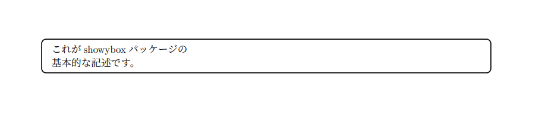
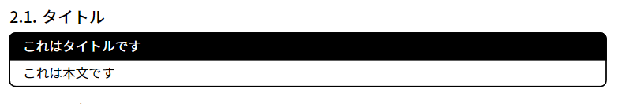
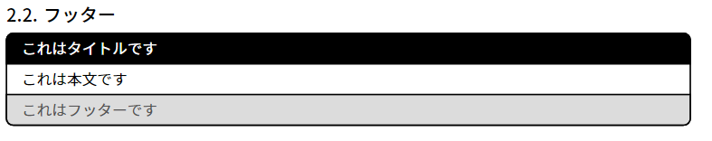

# はじめに
今回は、Typstで式やテキストを装飾する**showybox**パッケージを紹介します。[Typst Universe](https://typst.app/universe)上のページは[こちら](https://typst.app/universe/package/showybox/)、GitHub上のリポジトリは[こちら](https://github.com/Pablo-Gonzalez-Calderon/showybox-package)で、2024年8月17日現在、最新バージョンとして**2.0.1**がリリースされています。

この記事では基本的に公式リポジトリの[Showybox's Manual.pdf](https://github.com/Pablo-Gonzalez-Calderon/showybox-package/blob/main/Showybox's%20Manual.pdf)を参考にしながら、showyboxパッケージの使い方を解説します。誤訳などが含まれている場合はコメント等でご指摘頂けると非常にありがたいです。

# 環境
2024年8月22日の時点での最新バージョンを利用しています。
- Typst: 0.11.1
- showybox: 2.0.1

# 導入
パッケージの導入は、Typst Universeのページに存在する他のパッケージと同様に行えます。

```typ
#import "@preview/showybox:2.0.1"
```

# 基本的な記述

showyboxパッケージを利用する際は、基本的に次のように記述します。
    
```typ
showybox()[これがshowyboxパッケージの\ 基本的な記述です。]
```

このように記述すると、次のように表示されます。見やすさのために改行を行っています。



記法としては、`#showybox()[]`で`showybox`関数を呼び出し、丸括弧`()`に各種パラメーター、角括弧`[]`に装飾したいテキスト等を記述する、という形になります。
デフォルトでは上記のような、
- No title (タイトルなし)
- No shadow (影なし)
- Not breakable (ページおよびコンテナの終端での改行なし)
- Black borders (黒い枠線)
- White background (白い背景)
- 5pt of border radius (角丸の半径5pt)
- 1pt of border thickness (枠線の太さ1pt)

というパラメーターが設定されています。

# パラメーター
バージョン`2.0.1`では、次のパラメーターが利用可能です。
- title
- footer
- frame
- title-style
- body-style
- footer-style
- sep
- shadow
- width
- align
- breakable
- spacing
- above
- below

## タイトル(title)
`title`パラメーターを利用することで、showyboxのタイトルを設定することができます。

```typ
#showybox(title:"これはタイトルです")[これは本文です]
```



タイトルに設定できるのは[str(文字列)](https://typst.app/docs/reference/foundations/str/)と[content(コンテンツ)](https://typst.app/docs/reference/foundations/content/)です。何も設定しなかった場合(デフォルト)は`""`(空文字列)が設定されます。

## フッター(footer)
`footer`パラメーターを利用することで、showyboxのフッターを設定することができます。

```typ
#showybox(title:"これはタイトルです",footer:"これはフッターです")[これは本文です]
```



こちらもタイトルと同様、設定できるのは`str`と`content`です。何も設定しなかった場合(デフォルト)は`""`(空文字列)が設定されます。


