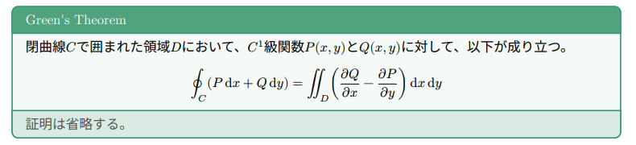
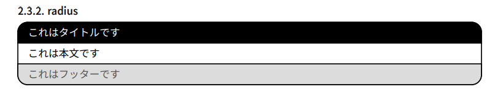
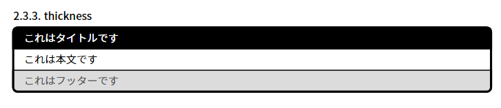
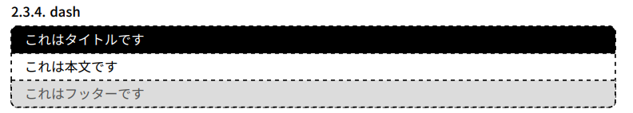
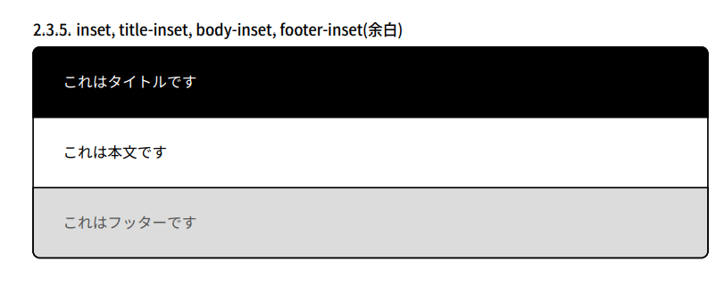
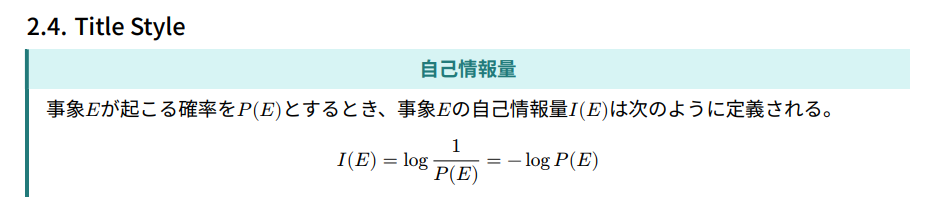

# はじめに
今回は、Typstで式やテキストを装飾する**showybox**パッケージを紹介します。[Typst Universe](https://typst.app/universe)上のページは[こちら](https://typst.app/universe/package/showybox/)、GitHub上のリポジトリは[こちら](https://github.com/Pablo-Gonzalez-Calderon/showybox-package)で、2024年8月17日現在、最新バージョンとして**2.0.1**がリリースされています。

この記事では基本的に公式リポジトリの[Showybox's Manual.pdf](https://github.com/Pablo-Gonzalez-Calderon/showybox-package/blob/main/Showybox's%20Manual.pdf)を参考にしながら、showyboxパッケージの使い方を解説します。誤訳などが含まれている場合はコメント等でご指摘頂けると非常にありがたいです。

# 環境
2024年8月22日の時点での最新バージョンを利用しています。
- Typst: 0.11.1
- showybox: 2.0.1

# 導入
パッケージの導入は、Typst Universeのページに存在する他のパッケージと同様に行えます。

```typ
#import "@preview/showybox:2.0.1"
```

# 基本的な記述

showyboxパッケージを利用する際は、基本的に次のように記述します。
    
```typ
showybox()[これがshowyboxパッケージの\ 基本的な記述です。]
```

このように記述すると、次のように表示されます。見やすさのために改行を行っています。


記法としては、`#showybox()[]`で`showybox`関数を呼び出し、丸括弧`()`に各種パラメーター、角括弧`[]`に装飾したいテキスト等を記述する、という形になります。
デフォルトでは上記のような、
- No title (タイトルなし)
- No shadow (影なし)
- Not breakable (ページおよびコンテナの終端での改行なし)
- Black borders (黒い枠線)
- White background (白い背景)
- 5pt of border radius (角丸の半径5pt)
- 1pt of border thickness (枠線の太さ1pt)

というパラメーターが設定されています。

# パラメーター
バージョン`2.0.1`では、次のパラメーターが利用可能です。
- title
- footer
- frame
- title-style
- body-style
- footer-style
- sep
- shadow
- width
- align
- breakable
- spacing
- above
- below

## title(タイトル)
`title`パラメーターを利用することで、showyboxのタイトルを設定することができます。

```typ
#showybox(title:"これはタイトルです")[これは本文です]
```


タイトルに設定できるのは[str(文字列)](https://typst.app/docs/reference/foundations/str/)と[content(コンテンツ)](https://typst.app/docs/reference/foundations/content/)です。何も設定しなかった場合(デフォルト)は`""`(空文字列)が設定されます。

## footer(フッター)
`footer`パラメーターを利用することで、showyboxのフッターを設定することができます。

```typ
#showybox(title:"これはタイトルです",footer:"これはフッターです")[これは本文です]
```


こちらもタイトルと同様、設定できるのは`str`と`content`です。何も設定しなかった場合(デフォルト)は`""`(空文字列)が設定されます。


## frame
このパラメーターには、showyboxのフレームの外観を指定するためのすべてのプロパティが含まれています。その内容を以下に示します。

- title-color
- body-color
- footer-color
- border-color
- radius
- thickness
- dash
- inset
- title-inset
- body-inset
- footer-inset

### title-color, body-color, footer-color, border-color(背景色)
それぞれの名称の通り、タイトルの背景、本文の背景、フッターの背景、枠線の色を指定します。指定できる色の種類や指定方法は[color](https://typst.app/docs/reference/visualize/color/)を参照してください。

一例は以下の通りです。

```typ
#showybox(title: "Green's Theorem", frame: (
  border-color: olive,
  title-color: olive.lighten(10%),
  body-color: olive.lighten(95%),
  footer-color: olive.lighten(80%),
), footer: "証明は省略する。")[
  閉曲線$C$で囲まれた領域$D$において、$C^1$級関数$P(x,y)$と$Q(x,y)$に対して、以下が成り立つ。
  $ integral.cont_C (P dif x + Q dif y ) = integral.double_D ((diff Q)/(diff x)-(diff P)/(diff y)) dif x dif y $
]
```



それぞれのプロパティは独立して指定できますが、ここでは見た目の統一感を出すためにあえて`olive`を基調としています。それに対して`lighten`メソッドを利用することで、それぞれの色を明るくしています。このような色の指定方法も、先程紹介した[color](https://typst.app/docs/reference/visualize/color/)のページが参考になると思います。

### radius(角丸)
`radius`プロパティは、角丸の半径を指定します。デフォルトは`5pt`です。

```typ
#showybox(title: "これはタイトルです", frame: (radius: 10pt), footer: "これはフッターです")[これは本文です]
```



値は`relative-length`や`dictionary`の形式で指定できます。

### thickness(枠線の太さ)
`thickness`プロパティは、枠線の太さを指定します。デフォルトは`1pt`です。

```typ
#showybox(title: "これはタイトルです", frame: (thickness: 2pt), footer: "これはフッターです")[これは本文です]
```



こちらも`relative-length`や`dictionary`の形式で指定できます。`dictionary`の場合は、`top`, `bottom`, `left`, `right`, `x`, `y`, `rest`のプロパティを指定できます。
ちなみに`box`内を分割している線(`separeaor`)の太さは、`thickness`プロパティではなく後述する`sep`プロパティで指定します。

### dash(破線)
`dash`プロパティは、枠線の破線の形状を`str`で指定します。デフォルトの値は `"solid"`(実線)です。

```typ
#showybox(title: "これはタイトルです", frame: (dash: "dashed"), footer: "これはフッターです")[これは本文です]
```



指定できる値は
- **solid**: 実線
- **dotted**: 点線
- **densely-dotted**: 密な点線
- **loosely-dotted**: 疎な点線
- **dashed**: 破線
- **densely-dashed**: 密な破線
- **loosely-dashed**: 疎な破線
- **dash-dotted**: 破線と点線の組み合わせ
- **densely-dash-dotted**: 密な破線と点線の組み合わせ
- **loosely-dash-dotted**: 疎な破線と点線の組み合わせ

です。

### inset, title-inset, body-inset, footer-inset(余白)
`inset`プロパティは、枠線の内側の余白を指定します。`title-inset`, `body-inset`, `footer-inset`は、それぞれタイトル、本文、フッターの内側の余白を指定します。

```typ
#showybox(title: "これはタイトルです", frame: (inset: 20pt, ), footer: "これはフッターです")[これは本文です]
```



値は`relative-length`や`dictionary`の形式で指定できます。`dictionary`の場合は、`top`, `bottom`, `left`, `right`, `x`, `y`, `rest`のプロパティを指定できます。デフォルトの値は`(x: 1em, y: 0.65em)`です。

`title-inset`, `body-inset`, `footer-inset`の値を指定した場合は、これらのプロパティはそれぞれタイトル、本文、フッターの余白を個別に設定します。このとき、`inset` プロパティは無視され、個別のインセットが優先されます。

## Title style
`title-style`パラメーターは、タイトルのスタイルを指定します。指定できるプロパティは次の通りです。

- color
- weight
- align
- sep-thickness
- boxed-style

### color
タイトルに用いるテキストの色を指定します。デフォルトは`white`です。

### weight
タイトルに用いるテキストの太さを指定します。指定できる値は`100`から`900`までの100刻み、または事前に定義されたキーワード("thin"、"extralight"、"light"、"regular"、"medium"、"semibold"、"bold"、
"extrabold"、"black")です。デフォルトは`regular`です。 

### align
タイトルのテキストの配置を指定します。指定できる値は`"left"`(左寄せ)、`"center"`（中央寄せ）、`"right"`（右寄せ）です。デフォルトは`"left"`です。

### sep-thickness
タイトルと本文を分割する線の太さを指定します。デフォルトは`1pt`です。

```typ
#showybox(
  title-style: (weight: 800, color: teal.darken(40%), sep-thickness: 0pt, align: center),
  frame: (title-color: teal.lighten(80%), border-color: teal.darken(40%), thickness: (left: 2pt), radius: 0pt),
  title: "自己情報量",
)[
  事象$E$が起こる確率を$P(E)$とするとき、事象$E$の自己情報量$I(E)$は次のように定義される。
  $ I(E) = log 1/(P(E)) = -log P(E) $
]
```



### boxed-style
このプロパティが`None`でない場合(すなわち辞書型の場合)、タイトルはfloating boxとして、本文の上部に表示されます。詳細は後述します。